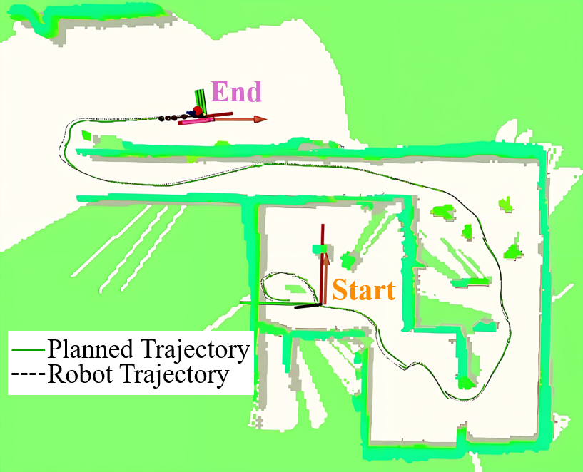

# TGH-Planner
Topology-Guided Hierarchical Planner for Nonholonomic Robots in Unknown and Complex Environments (Submitted to IEEE T-Mech). 

PDF Link: [TechRxiv](https://www.techrxiv.org/users/897374/articles/1274757-tgh-planner-topology-guided-hierarchical-planner-for-nonholonomic-robots-in-unknown-and-complex-environments?commit=1f84764f4edc345d91a809fd2cc0ea9d6597c29c).

Video：[bilibili](https://www.bilibili.com/video/BV1pK98YfEuY/?spm_id_from=333.1387.upload.video_card.click&vd_source=b0464106123611f8d997cd304ba81efe)

<p align="center">
    
</p>

**Contributions:**
- Propose a more effiecient UVD (Uniform Visibility Deformation) to accelerate HEC (Homotopy Equivalence Check).
- Design a topological path set to store historical paths, which not only provides consistent and stable guiding trajectories but also significantly reduces re-planning time
- Consider nonholonomic dynamics and unkown obstacle risks in local trajectory optimization to ensure safety.

Please kindly star :star: this project if it helps you. We take great efforts to develope and maintain it :grin::grin:.

TGH-Planner is based on the the excellent work of [FAST-Planner](https://github.com/HKUST-Aerial-Robotics/Fast-Planner).

## 1. Build and Start
**Dependencies:** Ubuntn20.04, ROS1, OpenCV. Install required tools:
```bash
sudo apt-get install ros-noetic-navigation \
ros-noetic-gazebo-* \
ros-noetic-gazebo-ros-control* \
ros-noetic-controller-* \
ros-noetic-tf2-* \
ros-noetic-octomap-* \
ros-noetic-velodyne-* \
ros-noetic-pointgrey-camera-description \
ros-noetic-twist-mux \
ros-noetic-teleop-twist-joy \
ros-noetic-lms1xx \
ros-noetic-interactive-marker-twist-server \
libgoogle-glog-dev \
libignition-common3-graphics-dev \
libignition-common3-profiler-dev \
python3-tk \
xterm
```
Download [gazebo_models](https://github.com/osrf/gazebo_models) in advance, and put them in directory `~/.gazebo/models`.

**Step1**:
```
  cd ${YOUR_WORKSPACE_PATH}/src
  git clone https://github.com/qimao7213/TGH-Planner.git
```
**Step2**:
Unzip the **3rd.zip** to a different path of your choice, and run the following codes for each folder:
```
  mkdir build && cd build && cmake ..
  make
  sudo make install
```
**Step3**:
Change the *nlopt path* in "*fast_planner/bspline_opt/CMakeLists.txt Line 19*" to your path. 
Change the *FilePath* in "*fast_planner/plan_manage/kino_replan.launch Line 5*" to your path if you want to save trajectory and odometry information.

**Step4**:
```
  catkin_make
```
If you meet: 
```
Could not find a package configuration file provided by "bspline" with any of the following names...
```
run
```
catkin_make -DCATKIN_WHITELIST_PACKAGES=bspline
```
and then 
```
catkin_make -DCATKIN_WHITELIST_PACKAGES=
```
**Step5**:
Open three terminals and run the following commands respectively:
```
  roscore
```
```
  roslaunch plan_manage rviz.launch
```
```
  roslaunch plan_manage kino_replan.launch
```
Then you can select a goal in Rviz and the robot will move.


### **Algorithm Configuration**
At the beginning of `kino_replan.launch`, there are three parameters: `use_teb`, `use_mpc`, and `sim_pose`. Their meanings are as follows:

- `use_teb=true`: The control command is ROS's `/cmd_vel` (linear and angular velocity). Otherwise, the control command is for the bicycle model (acceleration and front wheel steering angle).
- `use_mpc=true`: The global planning uses topological paths, and the local optimization uses B-spline curves. Otherwise, the global planning uses Voronoi graph, and the local control uses the *CMU local planner*.
- `sim_pose=true`: The robot's pose is generated by the Runge-Kutta integration. Otherwise, the robot's pose is generated by sending `/cmd_vel` to the Jackal robot, and the pose is derived from Gazebo ground truth.

Currently supported configurations are:

1. `use_teb=false`, `use_mpc=true`, `sim_pose=true`:  
   The control command is generated by the B-spline trajectory for the bicycle model, and the pose is obtained by integrating it with the Runge-Kutta method.

2. `use_teb=true`, `use_mpc=true`, `sim_pose=true`:  
   The control command is generated by the B-spline trajectory as `/cmd_vel`, and the pose is obtained by integrating it with the Runge-Kutta method.

3. `use_teb=**`, `use_mpc=true`, `sim_pose=false`:  
   The control command is generated by the B-spline trajectory as `/cmd_vel`, which is sent to the Jackal robot for execution. This mode only supports low speeds (1 m/s).

4. `use_teb=**`, `use_mpc=false`, `sim_pose=false`:  
   The control command is generated by the CMU local planner as `/cmd_vel`, which is sent to the Jackal robot for execution. This mode supports high speeds but is not suitable for environments with dense obstacles.


### **Generate /cmd_vel Commands**

Our control algorithm is implemented in *car_mpc_nodelet.cpp*. Originally, it is based on the bicycle model, using NMPC to track the B-spline trajectory and generate control commands (acceleration and front wheel steering angle).

Currently, there are two ways to generate `/cmd_vel` commands:
1. Convert the control commands generated by NMPC into `/cmd_vel` (this is already implemented and published).
2. Modify `if(0)` to `if(1)` at **Line 152** in the code, which will directly generate `/cmd_vel` commands from the B-spline trajectory.

**Note:**  
If you are using **fastlio2** as the pose estimation algorithm, make sure that the odometry information it publishes contains both velocity and angular velocity data.


### **TEB**
Run ``` sudo apt install ros-noetic-move-base ros-noetic-teb-local-planner ``` to install move_base and teb_planner. You can switch planner algorithm to **TEB** by set 
```
use_teb=true, use_mpc=false, sim_pose=true 
```
in the *"fast_planner/plan_manage/launch/kino_replan.launch"*. Then, run ``` roslaunch plan_manage robot_carlike_in_stage.launch ``` in a new terminator and the robot will move guided by **TEB**. The config files of **TEB** are at *"fast_planner/plan_manage/teb_nav/"*.

## 2. Some Utils
### Predifined Waypoints
Difine a set of waypoints in  "*fast_planner/plan_manage/config/waypts_2d.yaml*", and set "*fast_planner/plan_manage/launch/kino_replan.launch Line 88*" to 2. Then when you set any goal in Rviz, the robot will traverse the predefined waypoints.

### **Services**
Open ros service gui and you can see some services:
```
cd ${YOUR_WORKSPACE_PATH}/src
source devel/setup.bash
rosrun rqt_service_caller rqt_service_caller
```
- /car_simulator/set_init_pose

Set {x, y, yaw} pose to your robot. If the yaw > 360, the robot will be reset to the initial pose.
- /planning/reset_env

Reset the global map.
- /planning/traj_record

If you call a **True**, then the trajectory information will be recorded after the next planning is completed. The saved trajectory files are at "*test/traj_record*", **traj_cmd.txt** for the planned trajectory and **traj_real.txt** for the actual trajectory.

You can call a **False** to stop recording. If you set **Predifined Waypoints**, the recording will stop after traversing all waypoints.

In "*test/traj_record*", run
```
mkdir build && cd build
cmake .. && make
```
The executable files "calPathInfo" and "calTrajInfo" can be used to analyse trajectory information.

### **Record B-Spline Trajectory**
Set "*fast_planner/plan_manage/launch/kino_algorithm.xml Line 127*" to **true**, the latest optimized B-Spline Trajectories will be recored to "*test/data*". Use the "*.py*" functions to analyse the B-Spline Trajectories.

### **Draw Robot Trajectory on Map**
Use [collision_map_creator_plugin](https://github.com/tik0/collision_map_creator_plugin) to transform a Gazebo world to a "*.png*" 2D map.
Example code: 
```
./request_publisher "(-50,-10)(10,10)" 1 0.02 $(pwd)/map.png
```
In "*test/traj_record/src/drawTrajMap.cpp*", the *world_image_path* is the generated map.png above. 

The *origin_x* and *origin_y* are calculated as: 
*origin_xy* = *lowerleft.xy* - *map_offset_xy_*, where *lowerleft.xy* is (-50, -10) above, and *map_offset_xy_* is the parameters at "*uav_simulator/gazebo_simulator/launch/gazebo_sim.launch*".

## 3. Deployment on A Real Robot
We need **depth image**, **camera pose** and ?????. I will update this section later...

## 4. 
I will continue to improve this repository and enhance the code in the future.
